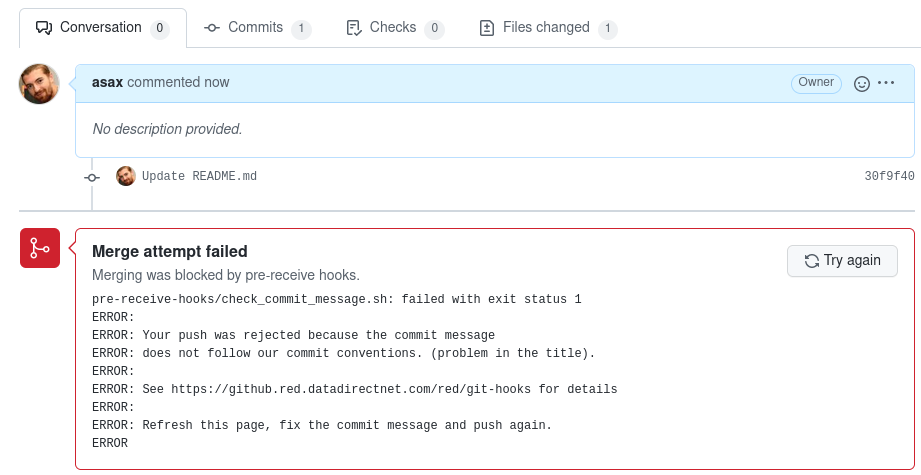
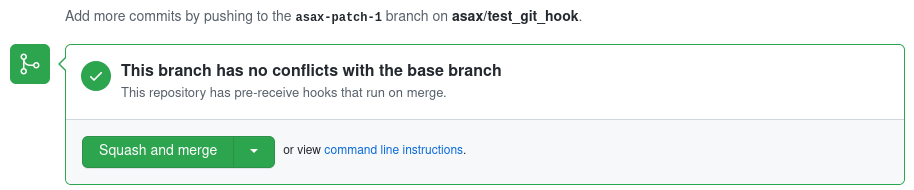
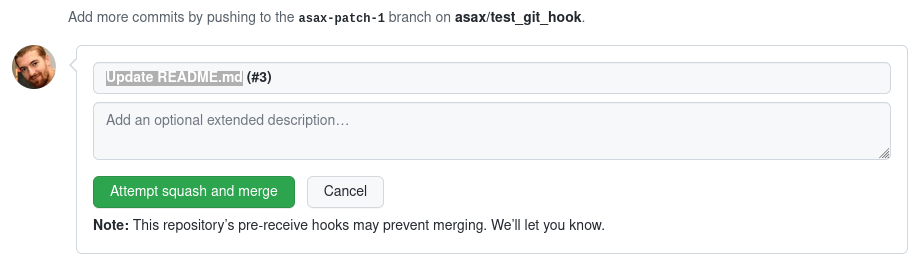
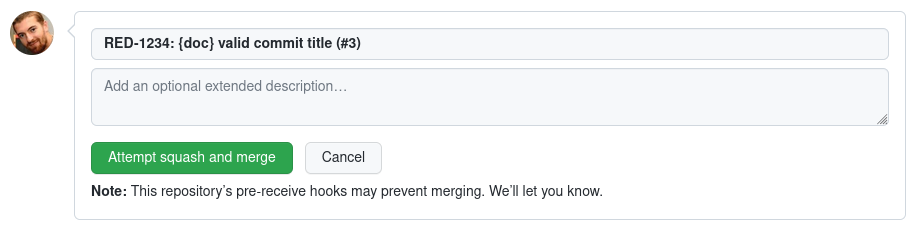

# git-hooks
Git hooks

## Convention for RED development
See [confluence page](https://ime-ddn.atlassian.net/wiki/spaces/RED/pages/146145288/Commit+Messages)

## Implemented checks
### check_commit_message.sh

  > Check only pushes on `main` branch

Try to follow RED convention. What is implemented?  
#### For the commit title line
- must begin with a Jira ticket ref, in uppercase, like `RED-2312` (supported projects are RED, REDQAS, REDOPS, REDDVOPS) followed by
- optional `!` to notify that the commit introduce breaking changes, followed by
- colon + **space** `:&nbsp;`, followed by
- optional scope in brackets, like `{docs}` or `{redsetup, redapi}`, followed by
- your commit title

Valid examples:
```
RED-124: my title
RED-456: {core} my title
RED-1234!: This commit introduce breaking changes
```
Invalid ones:
```
title without JIRA issue
RED-45:title, missing space
RED-45: {} brackets with empty content
```

## Troubleshooting


You should see this error popup if you tried to merge your PR and your commit message is wrong. What you have to do is refresh your browser page (`F5`)
to go back to this situation:


Click on `Squash and merge` button, to see next dialog:


Fix you commit message and click `Attempt squash and merge` button.


If your commit message is valid, PR will be merge.
Otherwise, you will have to do that process again until message is correct.
